Exercise 5
================

## Initial data manipulation

``` r
applications <- applications %>%
  mutate(wg = (floor(examiner_art_unit / 10) * 10)) %>%
  mutate(appl_status_date = dmy_hms(appl_status_date)) %>%
  mutate(year = year(appl_status_date)) %>%
  filter(year <= 2017) %>%
  drop_na(examiner_id)
```

``` r
examiners <- applications %>%
  group_by(examiner_id, examiner_art_unit, year) %>%
  summarise( 
    gender = first(gender),
    race = first(race),
    tc = first(tc),
    wg = first(wg)
    ) %>%
  drop_na(gender)
```

``` r
#creating datasets for gender counts by tc, wg and art unit

averages_au <- examiners %>%
  group_by(examiner_art_unit, gender, year) %>%
  summarise(gender_count_au = n_distinct(examiner_id),
            tc = first(tc),
            wg = first(wg))

averages_tc <- averages_au %>%
  group_by(tc, gender, year) %>%
  summarize(gender_count_tc = sum(gender_count_au))

averages_wg <- averages_au %>%
  group_by(wg, gender, year) %>%
  summarize(gender_count_wg = sum(gender_count_au),
            tc = first(tc)) 
```

## Visualizing average distributions across TC, WG and AU

``` r
#plotting raw counts
averages_tc %>%
  group_by(tc, gender) %>%
  summarize(y = mean(gender_count_tc)) %>%
  ggplot(aes(x = as.factor(tc), y = y, fill = gender)) +
  geom_col(position = "dodge")+
  labs(x = "Technology Centre", y = "Average count of genders", fill = "Gender") +
  ggtitle("Average gender distribution across technology centres") +
  theme_minimal() +
  scale_fill_manual(values = c("male" = "blue", "female" = "pink"))
```

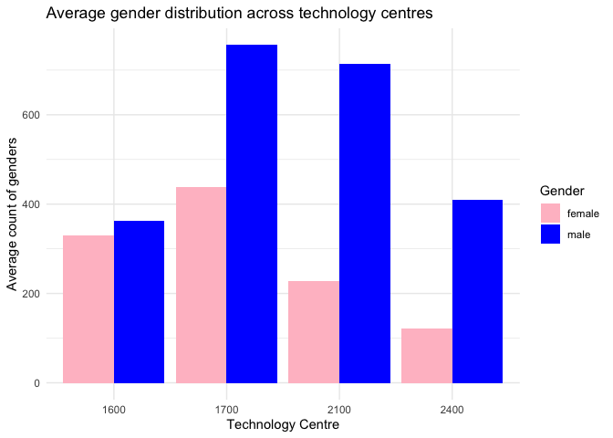<!-- -->

``` r
#plotting proportions
averages_tc %>%
  group_by(tc, gender) %>%
  summarize(y = mean(gender_count_tc)) %>%
  ggplot(aes(x = as.factor(tc), y = y, fill = gender)) +
  geom_col(position = "fill")+
  labs(x = "Technology Centre", y = "Average proportion of genders", fill = "Gender") +
  ggtitle("Average gender distribution across technology centres") +
  theme_minimal() +
  scale_fill_manual(values = c("male" = "blue", "female" = "pink"))
```

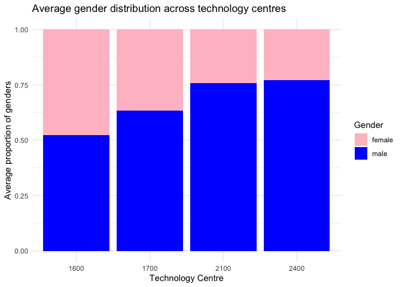<!-- -->

``` r
#selecting tc 1700 to analyze
averages_wg <- averages_wg %>%
  filter(tc=="1700") %>%
  filter(wg >= "1710")
  
#plotting raw counts
averages_wg %>%
  group_by(wg, gender) %>%
  summarize(y = mean(gender_count_wg)) %>%
  ggplot(aes(x = as.factor(wg), y = y, fill = gender)) +
  geom_col(position = "dodge")+
  labs(x = "Work Group", y = "Average count of genders", fill = "Gender") +
  ggtitle("Average gender distribution across work group") +
  theme_minimal() +
  scale_fill_manual(values = c("male" = "blue", "female" = "pink"))
```

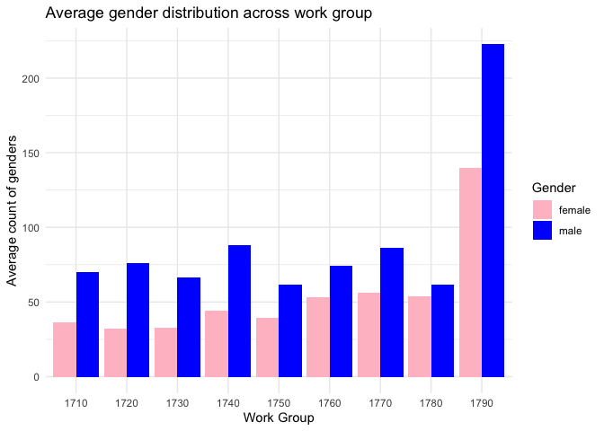<!-- -->

``` r
#plotting proportions
averages_wg %>%
  group_by(wg, gender) %>%
  summarize(y = mean(gender_count_wg)) %>%
  ggplot(aes(x = as.factor(wg), y = y, fill = gender)) +
  geom_col(position = "fill")+
  labs(x = "Work Group", y = "Average proportion of genders", fill = "Gender") +
  ggtitle("Average gender distribution across work group") +
  theme_minimal() +
  scale_fill_manual(values = c("male" = "blue", "female" = "pink"))
```

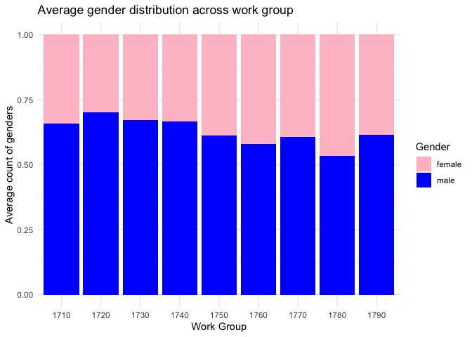<!-- -->

``` r
averages_au_1700 <- averages_au %>%
  filter(tc=="1700") %>%
  filter(examiner_art_unit >= "1710")

#plotting raw counts
averages_au_1700 %>%
  group_by(examiner_art_unit, gender) %>%
  summarize(y = mean(gender_count_au)) %>%
  ggplot(aes(x = examiner_art_unit, y = y, fill = gender)) +
  geom_col(position = "stack")+
  labs(x = "Art Unit", y = "Average count of genders", fill = "Gender") +
  ggtitle("Average gender distribution across art units") +
  theme_minimal() +
  scale_fill_manual(values = c("male" = "blue", "female" = "pink"))
```

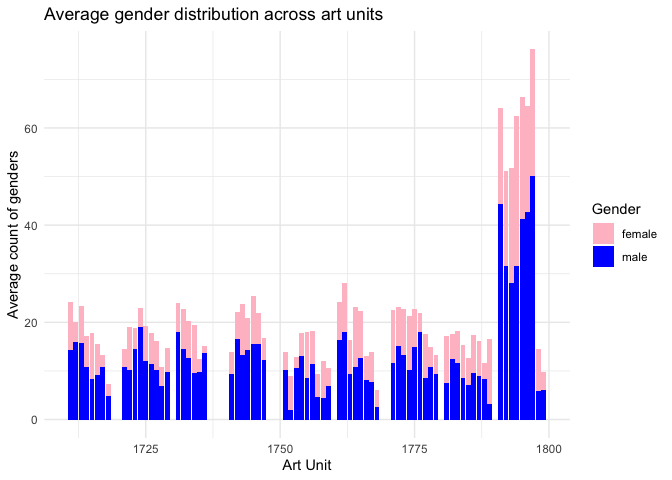<!-- -->

``` r
#plotting proportions
averages_au_1700 %>%
  group_by(examiner_art_unit, gender) %>%
  summarize(y = mean(gender_count_au)) %>%
  ggplot(aes(x = examiner_art_unit, y = y, fill = gender)) +
  geom_col(position = "fill")+
  labs(x = "Art Unit", y = "Average proportion of genders", fill = "Gender") +
  ggtitle("Average gender distribution across art units") +
  theme_minimal() +
  scale_fill_manual(values = c("male" = "blue", "female" = "pink"))
```

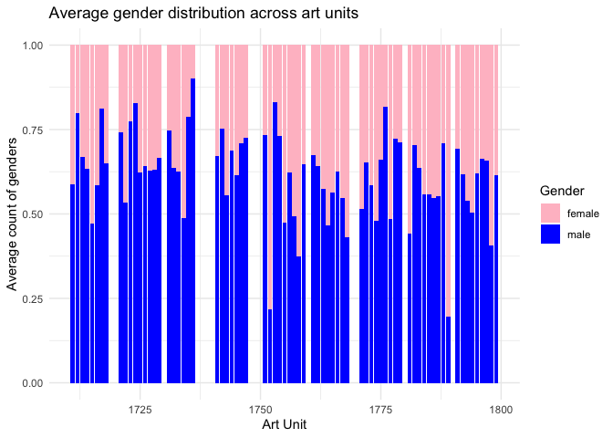<!-- -->

## Looking at individual examiner’s perspectives

``` r
#creating perception variables
perception_average_au <- averages_au_1700 %>%
  group_by(examiner_art_unit, year) %>%
  mutate(total_count = sum(gender_count_au)) %>%
  ungroup() %>%
  mutate(total_percep = gender_count_au*total_count) %>%
  group_by(examiner_art_unit, gender) %>%
  summarize(avg_percep = sum(total_percep)/sum(total_count),
            true_avg = mean(gender_count_au)
            )

#plotting average perception counts
perception_average_au %>%
  ggplot(aes(x = examiner_art_unit, y = avg_percep, fill = gender)) +
  geom_col(position = "stack")+
  labs(x = "Art Unit", y = "Average count of genders perceived", fill = "Gender") +
  ggtitle("Average perceived gender distribution across art units") +
  theme_minimal() +
  scale_fill_manual(values = c("male" = "blue", "female" = "pink"))
```

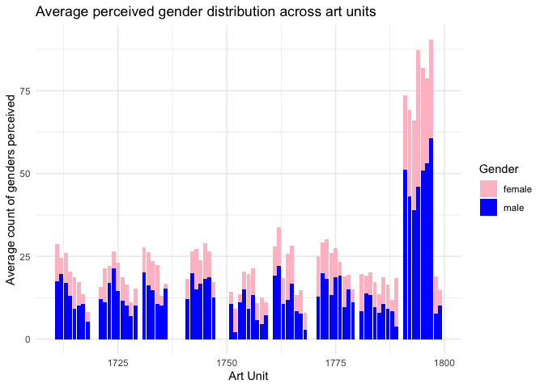<!-- -->

``` r
#plotting average perception proportions
perception_average_au %>%
  ggplot(aes(x = examiner_art_unit, y = avg_percep, fill = gender)) +
  geom_col(position = "fill")+
  labs(x = "Art Unit", y = "Average proportion of genders perceived", fill = "Gender") +
  ggtitle("Average perceived gender distribution across art units") +
  theme_minimal() +
  scale_fill_manual(values = c("male" = "blue", "female" = "pink"))
```

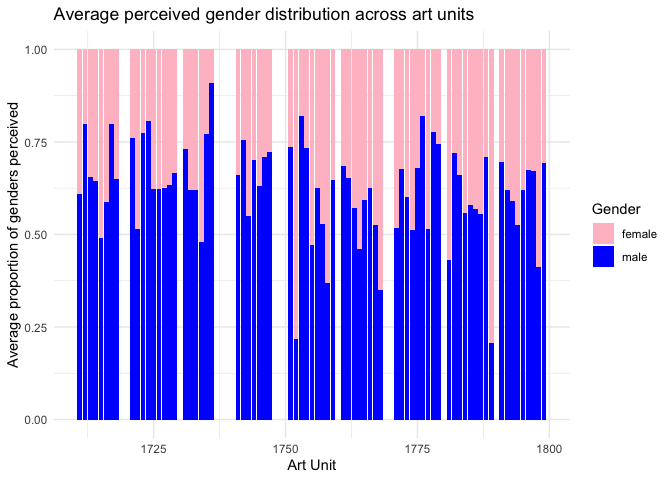<!-- -->

``` r
#plotting the difference between perception and true average
perception_average_au %>%
  group_by(examiner_art_unit, gender) %>%
  summarize(y = avg_percep - true_avg) %>%
  ggplot(aes(x = examiner_art_unit, y = y, fill= gender))+
  geom_col() +
  labs(x = "Art Unit", y = "Difference between averages") +
  ggtitle("Difference between perception and true average") +
  theme_minimal() +
  scale_fill_manual(values = c("male" = "blue", "female" = "pink"))
```

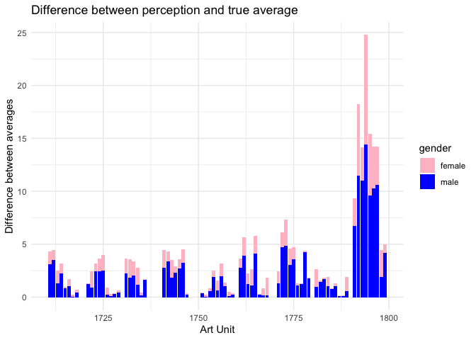<!-- -->

``` r
#extrapolating tc perception from individual art unit level
perception_average_tc <- averages_au %>%
  group_by(examiner_art_unit, year) %>%
  mutate(total_count = sum(gender_count_au)) %>%
  ungroup() %>%
  mutate(total_percep = gender_count_au*total_count) %>%
  group_by(examiner_art_unit, gender) %>%
  summarize(avg_percep = sum(total_percep)/sum(total_count),
            tc=first(tc)) %>%
  group_by(tc,gender) %>%
  summarize(perceived = sum(avg_percep))

#plotting the 'true average' proportion for tc we got earlier
averages_tc %>%
  group_by(tc, gender) %>%
  summarize(y = mean(gender_count_tc)) %>%
  ggplot(aes(x = as.factor(tc), y = y, fill = gender)) +
  geom_col(position = "fill")+
  labs(x = "Technology Centre", y = "Average proportion of genders", fill = "Gender") +
  ggtitle("Average gender distribution across technology centres") +
  theme_minimal() +
  scale_fill_manual(values = c("male" = "blue", "female" = "pink"))
```

<!-- -->

``` r
#plotting the perceived average proportion for tc
perception_average_tc %>%
  ggplot(aes(x = as.factor(tc), y = perceived, fill = gender)) +
  geom_col(position = "fill")+
  labs(x = "Technology Centre", y = "Average perceived proportion of genders", fill = "Gender") +
  ggtitle("Average perceived gender distribution across technology centres") +
  theme_minimal() +
  scale_fill_manual(values = c("male" = "blue", "female" = "pink"))
```

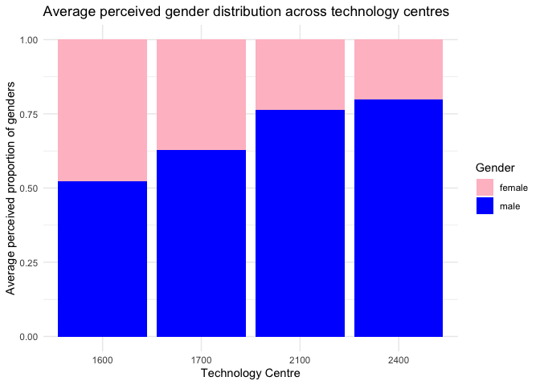<!-- -->

``` r
#plotting the perceived average counts for tc
perception_average_tc %>%
  ggplot(aes(x = as.factor(tc), y = perceived, fill = gender)) +
  geom_col(position = "dodge")+
  labs(x = "Technology Centre", y = "Average perceived count of genders", fill = "Gender") +
  ggtitle("Average perceived gender distribution across technology centres") +
  theme_minimal() +
  scale_fill_manual(values = c("male" = "blue", "female" = "pink"))
```

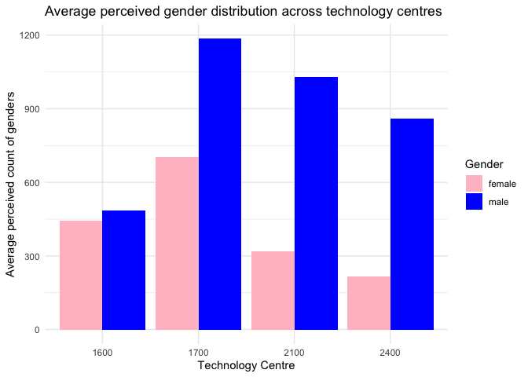<!-- -->

## Discussion and thoughts

For the purposes of this analysis, I chose to create a year variable and
then used it in the grouping to get more accurate representations of
what the gender make-up for each year looked like. For the sake of
consistency, I chose to show an average over the years for each level of
division. I then chose TC1700 to analyze, and removed the data from WG
1700 (1700-1709) as this appears to be an administrative work group with
very few applications processed.

To show perception, I created a new variable by multiplying the total
count of examiners in a given art unit by the count for each gender.
That is, on a team of 10 in a given year with 4 women, the new
perception variable for women would be 40. I then got the average
perception by dividing the sum of this new variable by the sum of total
counts over the years.

There were differences between the perceived averages and the ‘true’
averages, which were amplified by how many people were in each art unit.
WG 1790, which deals with food and chemistry, amongst other things, had
the highest number of people and the highest average difference in
perception.

I then extrapolated the averages at the TC level from the art unit data,
and here there was another significant difference in the numbers. While
proportions did not change that drastically, there was a large
difference in the counts perceived versus the averages. It is
interesting to note that based on the proportions, perception of gender
equality improved slightly for 1600 and 1700, while it worsened for 2100
and 2400. In essence, individual examiners perceived more equality than
there actually was in 1600 and 1700, and less so in 2100 and 2400.

To investigate the effects of this further, we could see how perception
changed over time for art units, workgroups or technology centres, as
this may have affected how the overall averages changed. For example, if
a work group was perceived to have more inequality over a certain year,
that may lead to complaints and a change in hiring policies the
following year, or more people from the minority gender could leave and
exacerbate the issue.
