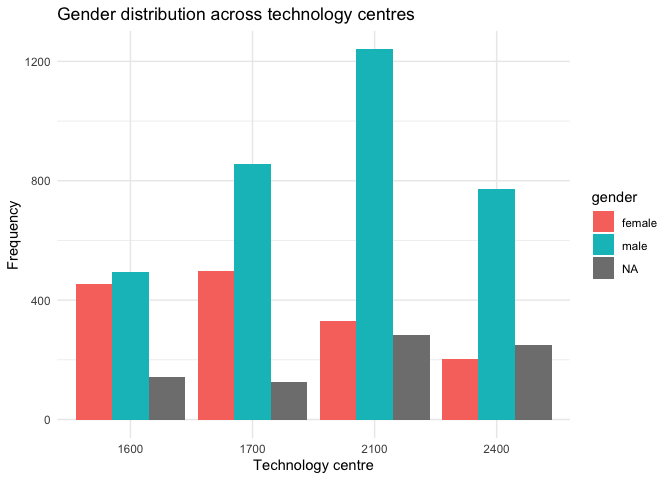
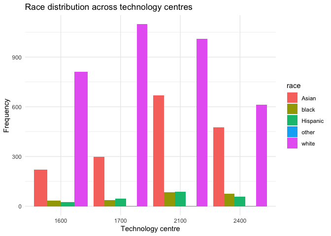
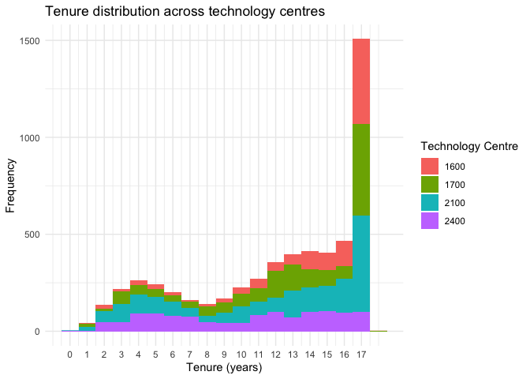

Exercise 3
================

## Gender distribution across technology centres

<!-- -->

## Race distribution across technology centres

<!-- -->

## Tenure distribution across technology centres

    ## Warning: Removed 24 rows containing non-finite values (`stat_bin()`).

<!-- -->

## Findings of distributions

#### Gender

There does seem to be a considerable imbalance between genders. While in
certain TC’s this could be due to the field itself, it is likely that
the gender predicted is not correct. This may potentially be due to the
presence of foreign names that the wru package is not able to process
accurately.

#### Race

It is difficult to discern whether these distributions are accurate to
the proportions of race. In particular, it is possible that those
predicted as ‘white’ could actually be of another race but have a name
that is more commonly associated with Caucasions.

#### Tenure

The distribution of tenure is interesting as there is heavy spike among
most towards people who have been there for 16 years or more. However,
this does not seem to be the case with Technology Centre 2400, which has
a relatively even distribution across tenures.

## Creating the linear model

### With TC and Gender

    ## Joining with `by = join_by(year)`

    ## # A tibble: 4 × 4
    ## # Groups:   gender [2]
    ##   gender  left     n    pct
    ##   <chr>  <dbl> <int>  <dbl>
    ## 1 female     0   156 0.934 
    ## 2 female     1    11 0.0659
    ## 3 male       0   346 0.918 
    ## 4 male       1    31 0.0822

    ## Joining with `by = join_by(examiner_id, min_year, max_year, tc, gender, race,
    ## year_left, left)`

    ## # A tibble: 5 × 5
    ##   term              estimate std.error statistic  p.value
    ##   <chr>                <dbl>     <dbl>     <dbl>    <dbl>
    ## 1 (Intercept)         0.0406    0.0281     1.45  0.149   
    ## 2 gendermale         -0.0315    0.0282    -1.12  0.265   
    ## 3 as.factor(tc)1700   0.0316    0.0344     0.917 0.359   
    ## 4 as.factor(tc)2100   0.110     0.0303     3.63  0.000314
    ## 5 as.factor(tc)2400  -0.0217    0.121     -0.180 0.857

    ## 
    ## Call:
    ## lm(formula = left ~ gender + as.factor(tc), data = training_set)
    ## 
    ## Residuals:
    ##      Min       1Q   Median       3Q      Max 
    ## -0.15055 -0.11909 -0.07216 -0.04060  0.99086 
    ## 
    ## Coefficients:
    ##                   Estimate Std. Error t value Pr(>|t|)    
    ## (Intercept)        0.04060    0.02808   1.446 0.148839    
    ## gendermale        -0.03146    0.02817  -1.117 0.264731    
    ## as.factor(tc)1700  0.03156    0.03440   0.917 0.359498    
    ## as.factor(tc)2100  0.10995    0.03028   3.631 0.000314 ***
    ## as.factor(tc)2400 -0.02173    0.12075  -0.180 0.857283    
    ## ---
    ## Signif. codes:  0 '***' 0.001 '**' 0.01 '*' 0.05 '.' 0.1 ' ' 1
    ## 
    ## Residual standard error: 0.265 on 458 degrees of freedom
    ## Multiple R-squared:  0.03114,    Adjusted R-squared:  0.02268 
    ## F-statistic: 3.681 on 4 and 458 DF,  p-value: 0.005802

    ## [1] 1

## Findings

With the size of the data set, we are not able to get any significantly
valuable predictions. In the linear model, we also see that none of the
predictors are statistically significant, and the overall R-squared is
extremely low. One major reason for this could be that a linear
regression is not suitable for making predictions for a binary outcome.

### With race added

    ## # A tibble: 8 × 5
    ##   term              estimate std.error statistic  p.value
    ##   <chr>                <dbl>     <dbl>     <dbl>    <dbl>
    ## 1 (Intercept)         0.147     0.0401     3.66  0.000284
    ## 2 gendermale         -0.0276    0.0278    -0.993 0.321   
    ## 3 as.factor(tc)1700   0.0325    0.0340     0.954 0.341   
    ## 4 as.factor(tc)2100   0.0961    0.0304     3.17  0.00165 
    ## 5 as.factor(tc)2400  -0.0562    0.120     -0.467 0.641   
    ## 6 raceblack          -0.129     0.0702    -1.84  0.0666  
    ## 7 raceHispanic       -0.197     0.0844    -2.33  0.0203  
    ## 8 racewhite          -0.120     0.0333    -3.60  0.000350

    ## 
    ## Call:
    ## lm(formula = left ~ gender + as.factor(tc) + race, data = training_set)
    ## 
    ## Residuals:
    ##      Min       1Q   Median       3Q      Max 
    ## -0.24276 -0.09504 -0.05902 -0.02256  1.00109 
    ## 
    ## Coefficients:
    ##                   Estimate Std. Error t value Pr(>|t|)    
    ## (Intercept)        0.14663    0.04009   3.658 0.000284 ***
    ## gendermale        -0.02765    0.02784  -0.993 0.321212    
    ## as.factor(tc)1700  0.03246    0.03403   0.954 0.340724    
    ## as.factor(tc)2100  0.09613    0.03037   3.165 0.001654 ** 
    ## as.factor(tc)2400 -0.05619    0.12024  -0.467 0.640500    
    ## raceblack         -0.12909    0.07020  -1.839 0.066578 .  
    ## raceHispanic      -0.19655    0.08441  -2.328 0.020325 *  
    ## racewhite         -0.12007    0.03333  -3.603 0.000350 ***
    ## ---
    ## Signif. codes:  0 '***' 0.001 '**' 0.01 '*' 0.05 '.' 0.1 ' ' 1
    ## 
    ## Residual standard error: 0.2617 on 455 degrees of freedom
    ## Multiple R-squared:  0.06169,    Adjusted R-squared:  0.04725 
    ## F-statistic: 4.273 on 7 and 455 DF,  p-value: 0.0001371

    ## [1] 1

## Findings after adding race

Adding race only slightly improves the accuracy of the model, however
this is still not sufficient for making predictions on binary outcomes.
In theory, this could be slightly improved by adjusting the thresholds
for classification, however deciding on a suitable threshold is quite
difficult.
