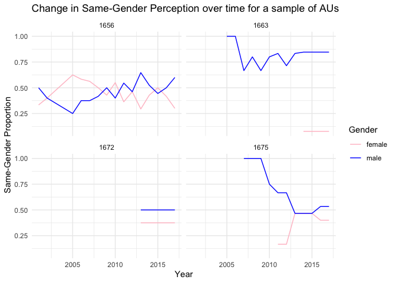

Exercise 4
================

    ## # A tibble: 3 × 2
    ##   `gender == "male"`     n
    ##   <lgl>              <int>
    ## 1 FALSE                456
    ## 2 TRUE                 497
    ## 3 NA                   140

### Visualizing

I selected Technology Centre 1600 to analyze as the proportion of male
and female examiners was closer than any other centre. I chose to remove
examiners with ‘NA’ in gender, which resulted in 140 examiner’s records
being removed (out of a total 1093 - approximately 12.8%).

I could potentially have filled this at random with proportions similar
to the existing identified male or female, however it is difficult to
say whether this would be even remotely accurate or have value for the
results.

I wanted to show how distributions and proportions changed over time, so
I included years in my pre-processed data.
<!-- -->

<!-- --><!-- -->

<!-- --><!-- -->

### Depicting perceptions of gender composition

    ## Warning: Removed 12 rows containing missing values (`position_stack()`).

<!-- --><!-- -->

### Thoughts on differences between gender proportions at different levels

As we zoom in from the TC level to the art unit level, we see
considerable variation in the data. Certain art units, on average, have
considerably more women than men and vice-versa. However, when looking
at the work group level, we see that over time the proportion tends to
even out as time passes.

WG 1600 seems to be an exception, although this may be due to the fact
that the total number of examiners is much lower in that group than in
the other seven WG. The data also does not start until 2004, indicating
that it may be a new workgroup altogether, and has not reached the
maturity levels others may have.

At the art unit level, it is difficult to discern a trend, although in
general it seems if the proportion in one year drops, the proportion in
the next year may increase. This could be due to conscious hiring
decisions to balance teams, but the impact is difficult to measure.

In general, it seems any conscious efforts to equalize gender
proportions seems to be at the TC level. This may trickle down into the
WG level, which can then trickle down into art units, but as long as
metrics at the TC level are even the variation at the minute level can
be allowed.
