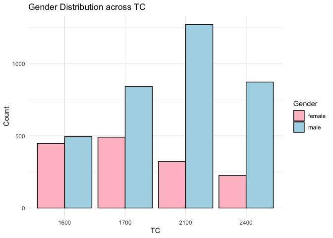
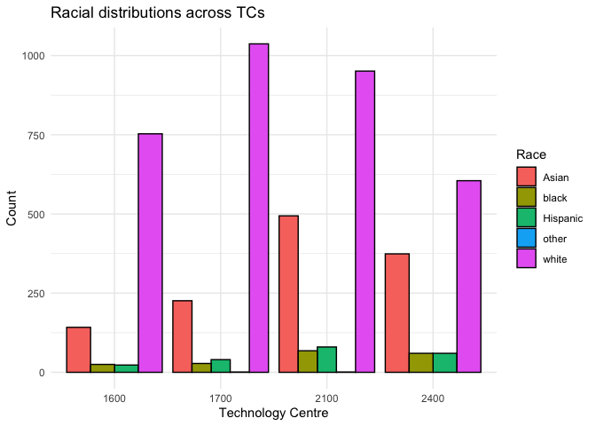
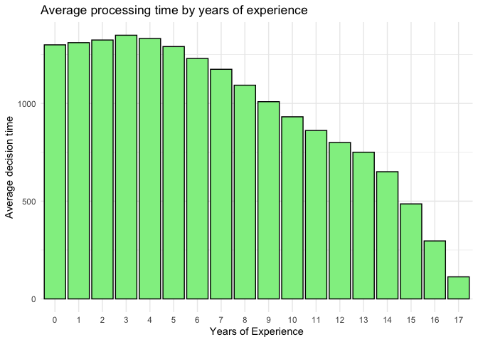

Group Project
================

``` r
applications_project <- applications_project %>%
  drop_na(application_number) %>%
  filter(application_number != "08531853")
```

``` r
#creating a new dataset of issued and abandoned applications

length_df <- applications_project %>%
  filter(disposal_type != "PEND") %>%
  drop_na(disposal_type)

#transforming by creating app length variable, cleaning and subtracting 60 days in cases where application was abandoned due to lack of response (to approximate the final patent office decision date)

length_df <- length_df %>%
  mutate(app_length = if_else(disposal_type == "ISS", interval(filing_date, patent_issue_date) %/% days(1),interval(filing_date, abandon_date) %/% days(1))) %>%
  mutate(wg = (floor(examiner_art_unit / 10) * 10)) %>%
  filter(app_length >= 0)%>%
  filter(app_length <= 6385) %>%
  mutate(app_length = if_else(appl_status_code == 161 & app_length > 60, app_length - 60, app_length))%>%
  drop_na(app_length) %>%
  mutate(year_submitted = year(filing_date))

#removing outliers of average processing time

avg_time <- length_df %>%
  drop_na(examiner_id) %>%
  drop_na(gender) %>%
  group_by(examiner_id) %>%
  summarize(avg_app_length = mean(app_length),
            )

is_outlier <- function(x) {
  q <- quantile(x, probs = c(0.25, 0.75))
  iqr <- q[2] - q[1]
  lower_bound <- q[1] - (1.5 * iqr)
  upper_bound <- q[2] + (1.5 * iqr)
  x < lower_bound | x > upper_bound
}

filtered <- avg_time %>%
  filter(!is_outlier(avg_app_length))

length_df <- length_df %>%
  drop_na(gender) %>%
  drop_na(examiner_id) %>%
  semi_join(filtered, by = "examiner_id")
```

``` r
#average time taken per app for gender
length_df %>%
  group_by(gender) %>%
  summarize(y = mean(app_length)) %>%
  ggplot(aes(x = gender, y = y, fill=gender)) +
  geom_col(position = "dodge", color="black")+
  labs(x = "Gender", y = "Average days for application completion", fill = "Gender") +
  ggtitle("Average application length by gender") +
  theme_minimal()+
  scale_fill_manual(values = c("male" = "lightblue", "female" = "pink"))
```

<!-- -->

``` r
#average time taken per app for race
length_df %>%
  group_by(race) %>%
  summarize(y = mean(app_length)) %>%
  ggplot(aes(x = as.factor(race), y = y,fill=race)) +
  geom_col(position = "dodge", color="black")+
  labs(x = "Technology Centre", y = "Average days for application completion", fill = "Race") +
  ggtitle("Average processing times by race") +
  theme_minimal()
```

<!-- -->

``` r
#average application times by TC
length_df %>%
  group_by(tc) %>%
  summarize(y = mean(app_length)) %>%
  ggplot(aes(x = as.factor(tc), y = y, fill=as.factor(tc))) +
  geom_col(color="black")+
  labs(x = "Technology Centre", y = "Average days for application completion", fill = "TC") +
  ggtitle("Average processing times by TC") +
  scale_fill_manual(values = c("1600" = "green", "1700" = "purple", "2100"="darkblue", "2400"="red"))+
  theme_minimal()
```

<!-- -->

``` r
gender_avg <- length_df %>%
  group_by(gender) %>%
  summarize(y = mean(app_length))

race_avg <- length_df %>%
  group_by(race) %>%
  summarize(y = mean(app_length))

tc_avg <- length_df %>%
  group_by(tc) %>%
  summarize(y = mean(app_length))

  
#distribution of app length based on final decision (issued or abandoned)  
length_df %>%
  ggplot(aes(y = app_length, fill = disposal_type)) +
  geom_boxplot(outlier.shape = NA) +
  facet_wrap(~ disposal_type, nrow = 1) +
  coord_cartesian(ylim = c(0, 3000)) +
  theme_minimal()+
  scale_fill_manual(values = c("ISS" = "darkgreen", "ABN" = "darkred"))+
  labs(y = "Application length") +
  ggtitle("Application length by final decision")+
  theme(axis.text.x = element_blank())
```

<!-- -->

``` r
#gender distribution
length_df %>%
  group_by(gender, tc) %>%
  summarize(n = n_distinct(examiner_id)) %>%
  ggplot(aes(x = as.factor(tc), y = n, fill=gender)) +
  geom_col(position = "dodge", color="black")+
  labs(x = "TC", y = "Count", fill = "Gender") +
  ggtitle("Gender Distribution across TC") +
  theme_minimal()+
  scale_fill_manual(values = c("male" = "lightblue", "female" = "pink"))
```

    ## `summarise()` has grouped output by 'gender'. You can override using the
    ## `.groups` argument.

<!-- -->

``` r
#racial distribution across TC
length_df %>%
  group_by(race, tc) %>%
  summarize(n = n_distinct(examiner_id)) %>%
  ggplot(aes(x = as.factor(tc), y = n, fill=race)) +
  geom_col(position = "dodge", color="black")+
  labs(x = "Technology Centre", y = "Count", fill = "Race") +
  ggtitle("Racial distributions across TCs") +
  theme_minimal()
```

    ## `summarise()` has grouped output by 'race'. You can override using the
    ## `.groups` argument.

<!-- -->

``` r
#total distribution across TC
length_df %>%
  group_by(tc) %>%
  summarize(n = n_distinct(examiner_id)) %>%
  ggplot(aes(x = as.factor(tc), y = n, fill=as.factor(tc))) +
  geom_col(position = "dodge", color="black")+
  labs(x = "Technology Centre", y = "Count", fill = "TC") +
  ggtitle("Distribution of employees across TCs") +
  theme_minimal()+
  scale_fill_manual(values = c("1600" = "green", "1700" = "purple", "2100"="darkblue", "2400"="red"))
```

<!-- -->

``` r
#distribution of decision type by gender
length_df %>%
  group_by(gender, disposal_type) %>%
  summarize(count = n()) %>%
  ggplot(aes(x = gender, y = count, fill=disposal_type)) +
  geom_col(position = "fill")+
  labs(x = "Gender", y = "Decision proportion", fill = "Disposal Type") +
  ggtitle("Distribution of decision type by gender") +
  theme_minimal()+
  scale_fill_manual(values = c("ISS" = "darkgreen", "ABN" = "darkred"))
```

    ## `summarise()` has grouped output by 'gender'. You can override using the
    ## `.groups` argument.

<!-- -->

``` r
#distribution of decision type by race
length_df %>%
  group_by(race, disposal_type) %>%
  summarize(count = n()) %>%
  ggplot(aes(x = race, y = count, fill=disposal_type)) +
  geom_col(position = "fill")+
  labs(x = "Race", y = "Decision proportion", fill = "Disposal Type") +
  ggtitle("Distribution of decision type by race") +
  theme_minimal() +
  scale_fill_manual(values = c("ISS" = "darkgreen", "ABN" = "darkred"))
```

    ## `summarise()` has grouped output by 'race'. You can override using the
    ## `.groups` argument.

<!-- -->

``` r
#distribution of decision type by TC
length_df %>%
  group_by(tc, disposal_type) %>%
  summarize(count = n()) %>%
  ggplot(aes(x = as.factor(tc), y = count, fill=disposal_type)) +
  geom_col(position = "fill")+
  labs(x = "Technology Centre", y = "Decision proportion", fill = "Disposal Type") +
  ggtitle("Distribution of decision type by TC") +
  theme_minimal()+
  scale_fill_manual(values = c("ISS" = "darkgreen", "ABN" = "darkred"))
```

    ## `summarise()` has grouped output by 'tc'. You can override using the `.groups`
    ## argument.

<!-- -->

``` r
#average processing time based on decision for each gender
length_df %>%
  group_by(gender, disposal_type) %>%
  summarize(y = mean(app_length)) %>%
  ggplot(aes(x = gender, y = y, fill=disposal_type)) +
  geom_col(position = "dodge", color="black")+
  labs(x = "Gender", y = "Decision time", fill = "Disposal Type") +
  ggtitle("Average processing time for each decision type by gender ") +
  theme_minimal()+
  scale_fill_manual(values = c("ISS" = "darkgreen", "ABN" = "darkred"))
```

    ## `summarise()` has grouped output by 'gender'. You can override using the
    ## `.groups` argument.

<!-- -->

``` r
#average processing time based on decision for each race
length_df %>%
  group_by(race, disposal_type) %>%
  summarize(y = mean(app_length)) %>%
  ggplot(aes(x = race, y = y, fill=disposal_type)) +
  geom_col(position = "dodge", color="black")+
  labs(x = "Race", y = "Decision time", fill = "Disposal Type") +
  ggtitle("Average processing time for each decision type by race") +
  theme_minimal()+
  scale_fill_manual(values = c("ISS" = "darkgreen", "ABN" = "darkred"))
```

    ## `summarise()` has grouped output by 'race'. You can override using the
    ## `.groups` argument.

<!-- -->

``` r
#average processing time based on decision for each tc
length_df %>%
  group_by(tc, disposal_type) %>%
  summarize(y = mean(app_length)) %>%
  ggplot(aes(x = as.factor(tc), y = y, fill=disposal_type)) +
  geom_col(position = "dodge", color="black")+
  labs(x = "Technology Centre", y = "Decision time", fill = "Disposal Type") +
  ggtitle("Average processing time for each decision type by TC") +
  theme_minimal()+
  scale_fill_manual(values = c("ISS" = "darkgreen", "ABN" = "darkred"))
```

    ## `summarise()` has grouped output by 'tc'. You can override using the `.groups`
    ## argument.

<!-- -->

``` r
#creating a regression dataframe
average_length <- length_df %>%
  group_by(examiner_id, disposal_type) %>%
  summarize(
    gender= first(gender),
    race = first(race),
    tc = first(tc),
    avg_length = mean(app_length),
    tenure = first(tenure_days)
  )

#regression with preprocessed set
model_avg <- lm(data = average_length, avg_length ~ as.factor(tc) + as.factor(gender) + as.factor(race) + as.factor(disposal_type))

model_avg_wt <- lm(data = average_length, avg_length ~ as.factor(tc) + as.factor(gender) + as.factor(race) + as.factor(disposal_type) + tenure)

summary(model_avg)
```

    ## 
    ## Call:
    ## lm(formula = avg_length ~ as.factor(tc) + as.factor(gender) + 
    ##     as.factor(race) + as.factor(disposal_type), data = average_length)
    ## 
    ## Residuals:
    ##      Min       1Q   Median       3Q      Max 
    ## -1128.91  -200.48    -3.61   197.89  1942.25 
    ## 
    ## Coefficients:
    ##                             Estimate Std. Error t value Pr(>|t|)    
    ## (Intercept)                  980.221     10.510  93.266  < 2e-16 ***
    ## as.factor(tc)1700             26.227      9.199   2.851  0.00437 ** 
    ## as.factor(tc)2100            199.471      9.334  21.371  < 2e-16 ***
    ## as.factor(tc)2400            197.734     10.278  19.239  < 2e-16 ***
    ## as.factor(gender)male        -20.584      7.045  -2.922  0.00349 ** 
    ## as.factor(race)black         -28.593     18.191  -1.572  0.11603    
    ## as.factor(race)Hispanic      -27.258     16.661  -1.636  0.10187    
    ## as.factor(race)other         296.641    149.171   1.989  0.04678 *  
    ## as.factor(race)white         -11.095      7.590  -1.462  0.14385    
    ## as.factor(disposal_type)ISS  187.205      6.292  29.752  < 2e-16 ***
    ## ---
    ## Signif. codes:  0 '***' 0.001 '**' 0.01 '*' 0.05 '.' 0.1 ' ' 1
    ## 
    ## Residual standard error: 298 on 8963 degrees of freedom
    ## Multiple R-squared:  0.1621, Adjusted R-squared:  0.1612 
    ## F-statistic: 192.6 on 9 and 8963 DF,  p-value: < 2.2e-16

``` r
summary(model_avg_wt)
```

    ## 
    ## Call:
    ## lm(formula = avg_length ~ as.factor(tc) + as.factor(gender) + 
    ##     as.factor(race) + as.factor(disposal_type) + tenure, data = average_length)
    ## 
    ## Residuals:
    ##      Min       1Q   Median       3Q      Max 
    ## -1231.72  -182.35     4.29   183.86  2021.51 
    ## 
    ## Coefficients:
    ##                               Estimate Std. Error t value Pr(>|t|)    
    ## (Intercept)                 657.540777  14.238532  46.180  < 2e-16 ***
    ## as.factor(tc)1700            58.877639   8.816004   6.678 2.56e-11 ***
    ## as.factor(tc)2100           242.681487   8.984766  27.010  < 2e-16 ***
    ## as.factor(tc)2400           284.440525  10.148500  28.028  < 2e-16 ***
    ## as.factor(gender)male       -18.186065   6.703079  -2.713  0.00668 ** 
    ## as.factor(race)black        -32.660094  17.316907  -1.886  0.05932 .  
    ## as.factor(race)Hispanic      -1.927813  15.835941  -0.122  0.90311    
    ## as.factor(race)other        244.715560 141.567122   1.729  0.08391 .  
    ## as.factor(race)white         -9.298622   7.217386  -1.288  0.19765    
    ## as.factor(disposal_type)ISS 184.433792   5.985583  30.813  < 2e-16 ***
    ## tenure                        0.060273   0.001902  31.693  < 2e-16 ***
    ## ---
    ## Signif. codes:  0 '***' 0.001 '**' 0.01 '*' 0.05 '.' 0.1 ' ' 1
    ## 
    ## Residual standard error: 282.8 on 8920 degrees of freedom
    ##   (42 observations deleted due to missingness)
    ## Multiple R-squared:  0.247,  Adjusted R-squared:  0.2462 
    ## F-statistic: 292.7 on 10 and 8920 DF,  p-value: < 2.2e-16

``` r
yoe_df <- length_df %>%
  drop_na(earliest_date) %>%
  mutate(yoe = year(filing_date)-year(earliest_date))

yoe_df %>%
  group_by(yoe) %>%
  summarize(y = mean(app_length)) %>%
  ggplot(aes(x = as.factor(yoe), y = y)) +
  geom_col(fill = "lightgreen", color="black") +
  labs(x = "Years of Experience", y = "Average decision time") +
  ggtitle("Average processing time by years of experience") +
  theme_minimal()
```

<!-- -->

``` r
yoe_reg <- yoe_df %>%
  group_by(examiner_id, disposal_type,yoe) %>%
  summarize(
    gender= first(gender),
    race = first(race),
    tc = first(tc),
    avg_length = mean(app_length),
    tenure = first(tenure_days)
  )
```

    ## `summarise()` has grouped output by 'examiner_id', 'disposal_type'. You can
    ## override using the `.groups` argument.

``` r
model_yoe_af <- lm(data = yoe_reg, avg_length ~ as.factor(tc) + as.factor(gender) + as.factor(race) + as.factor(disposal_type) + as.factor(yoe))

model_yoe <- lm(data = yoe_reg, avg_length ~ as.factor(tc) + as.factor(gender) + as.factor(race) + as.factor(disposal_type) + yoe)

summary(model_yoe_af)
```

    ## 
    ## Call:
    ## lm(formula = avg_length ~ as.factor(tc) + as.factor(gender) + 
    ##     as.factor(race) + as.factor(disposal_type) + as.factor(yoe), 
    ##     data = yoe_reg)
    ## 
    ## Residuals:
    ##     Min      1Q  Median      3Q     Max 
    ## -1584.4  -307.3   -21.0   247.7  4380.0 
    ## 
    ## Coefficients:
    ##                              Estimate Std. Error t value Pr(>|t|)    
    ## (Intercept)                  1658.344      8.444 196.385  < 2e-16 ***
    ## as.factor(tc)1700            -135.796      5.129 -26.477  < 2e-16 ***
    ## as.factor(tc)2100              19.007      5.513   3.448 0.000566 ***
    ## as.factor(tc)2400             127.806      5.747  22.239  < 2e-16 ***
    ## as.factor(gender)male         -26.522      4.062  -6.530 6.63e-11 ***
    ## as.factor(race)black          -17.554     10.309  -1.703 0.088623 .  
    ## as.factor(race)Hispanic       -59.115     10.224  -5.782 7.41e-09 ***
    ## as.factor(race)other          241.599     69.546   3.474 0.000513 ***
    ## as.factor(race)white          -23.250      4.397  -5.287 1.25e-07 ***
    ## as.factor(disposal_type)ISS   216.643      3.673  58.986  < 2e-16 ***
    ## as.factor(yoe)1              -168.129      8.776 -19.158  < 2e-16 ***
    ## as.factor(yoe)2              -228.488      8.765 -26.068  < 2e-16 ***
    ## as.factor(yoe)3              -276.826      8.855 -31.263  < 2e-16 ***
    ## as.factor(yoe)4              -333.945      8.967 -37.240  < 2e-16 ***
    ## as.factor(yoe)5              -408.016      9.104 -44.819  < 2e-16 ***
    ## as.factor(yoe)6              -476.806      9.251 -51.544  < 2e-16 ***
    ## as.factor(yoe)7              -545.030      9.395 -58.013  < 2e-16 ***
    ## as.factor(yoe)8              -635.691      9.541 -66.626  < 2e-16 ***
    ## as.factor(yoe)9              -727.608      9.739 -74.710  < 2e-16 ***
    ## as.factor(yoe)10             -825.008     10.026 -82.289  < 2e-16 ***
    ## as.factor(yoe)11             -915.887     10.385 -88.190  < 2e-16 ***
    ## as.factor(yoe)12             -984.030     10.971 -89.695  < 2e-16 ***
    ## as.factor(yoe)13            -1021.815     11.691 -87.400  < 2e-16 ***
    ## as.factor(yoe)14            -1107.533     12.633 -87.673  < 2e-16 ***
    ## as.factor(yoe)15            -1269.512     14.369 -88.349  < 2e-16 ***
    ## as.factor(yoe)16            -1464.788     19.577 -74.820  < 2e-16 ***
    ## as.factor(yoe)17            -1698.160    183.778  -9.240  < 2e-16 ***
    ## ---
    ## Signif. codes:  0 '***' 0.001 '**' 0.01 '*' 0.05 '.' 0.1 ' ' 1
    ## 
    ## Residual standard error: 519.4 on 80212 degrees of freedom
    ## Multiple R-squared:  0.3292, Adjusted R-squared:  0.329 
    ## F-statistic:  1514 on 26 and 80212 DF,  p-value: < 2.2e-16

``` r
summary(model_yoe)
```

    ## 
    ## Call:
    ## lm(formula = avg_length ~ as.factor(tc) + as.factor(gender) + 
    ##     as.factor(race) + as.factor(disposal_type) + yoe, data = yoe_reg)
    ## 
    ## Residuals:
    ##     Min      1Q  Median      3Q     Max 
    ## -1568.9  -308.1   -22.2   252.1  4415.4 
    ## 
    ## Coefficients:
    ##                              Estimate Std. Error  t value Pr(>|t|)    
    ## (Intercept)                 1624.4228     6.5866  246.625  < 2e-16 ***
    ## as.factor(tc)1700           -135.5656     5.1386  -26.382  < 2e-16 ***
    ## as.factor(tc)2100             19.3059     5.5240    3.495 0.000475 ***
    ## as.factor(tc)2400            129.8567     5.7556   22.562  < 2e-16 ***
    ## as.factor(gender)male        -26.2794     4.0702   -6.457 1.08e-10 ***
    ## as.factor(race)black         -17.4412    10.3311   -1.688 0.091372 .  
    ## as.factor(race)Hispanic      -58.9434    10.2456   -5.753 8.80e-09 ***
    ## as.factor(race)other         240.6325    69.6927    3.453 0.000555 ***
    ## as.factor(race)white         -23.4009     4.4065   -5.310 1.10e-07 ***
    ## as.factor(disposal_type)ISS  215.2188     3.6774   58.525  < 2e-16 ***
    ## yoe                          -78.3010     0.4312 -181.605  < 2e-16 ***
    ## ---
    ## Signif. codes:  0 '***' 0.001 '**' 0.01 '*' 0.05 '.' 0.1 ' ' 1
    ## 
    ## Residual standard error: 520.6 on 80228 degrees of freedom
    ## Multiple R-squared:  0.3262, Adjusted R-squared:  0.3261 
    ## F-statistic:  3884 on 10 and 80228 DF,  p-value: < 2.2e-16

``` r
tidy(model_yoe_af)
```

    ## # A tibble: 27 × 5
    ##    term                        estimate std.error statistic   p.value
    ##    <chr>                          <dbl>     <dbl>     <dbl>     <dbl>
    ##  1 (Intercept)                   1658.       8.44    196.   0        
    ##  2 as.factor(tc)1700             -136.       5.13    -26.5  8.30e-154
    ##  3 as.factor(tc)2100               19.0      5.51      3.45 5.66e-  4
    ##  4 as.factor(tc)2400              128.       5.75     22.2  3.07e-109
    ##  5 as.factor(gender)male          -26.5      4.06     -6.53 6.63e- 11
    ##  6 as.factor(race)black           -17.6     10.3      -1.70 8.86e-  2
    ##  7 as.factor(race)Hispanic        -59.1     10.2      -5.78 7.41e-  9
    ##  8 as.factor(race)other           242.      69.5       3.47 5.13e-  4
    ##  9 as.factor(race)white           -23.2      4.40     -5.29 1.25e-  7
    ## 10 as.factor(disposal_type)ISS    217.       3.67     59.0  0        
    ## # ℹ 17 more rows
