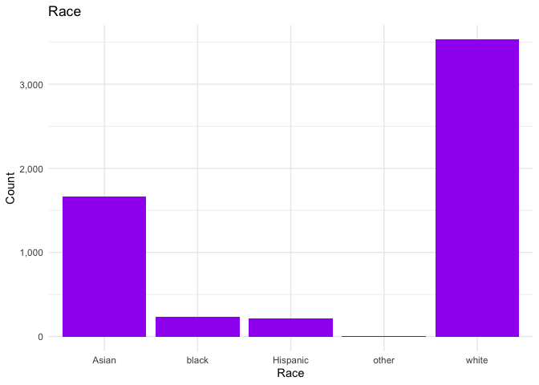
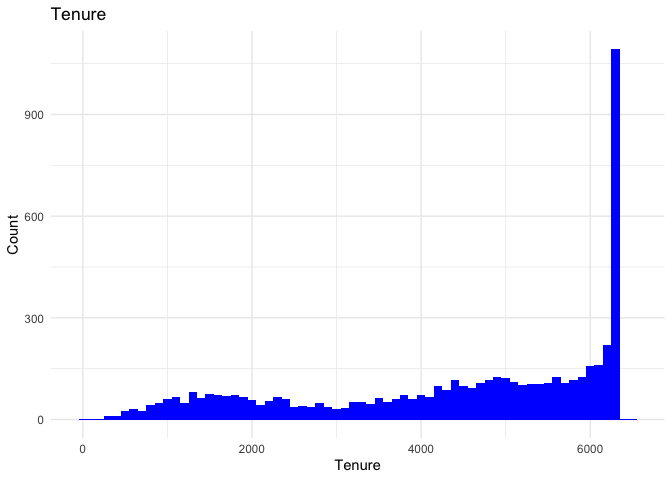

Exercise 2
================

### Sameer Kamal

## Load data

Load the following data: + applications from `app_data_sample.parquet` +
edges from `edges_sample.csv`

## Get gender for examiners

We’ll get gender based on the first name of the examiner, which is
recorded in the field `examiner_name_first`. We’ll use library `gender`
for that, relying on a modified version of their own
[example](https://cran.r-project.org/web/packages/gender/vignettes/predicting-gender.html).

Note that there are over 2 million records in the applications table –
that’s because there are many records for each examiner, as many as the
number of applications that examiner worked on during this time frame.
Our first step therefore is to get all *unique* names in a separate list
`examiner_names`. We will then guess gender for each one and will join
this table back to the original dataset. So, let’s get names without
repetition:

Now let’s use function `gender()` as shown in the example for the
package to attach a gender and probability to each name and put the
results into the table `examiner_names_gender`

Finally, let’s join that table back to our original applications data
and discard the temporary tables we have just created to reduce clutter
in our environment.

    ##            used  (Mb) gc trigger  (Mb) limit (Mb) max used  (Mb)
    ## Ncells  4441181 237.2    7872868 420.5         NA  4459866 238.2
    ## Vcells 49378939 376.8   92843687 708.4      16384 79694626 608.1

## Guess the examiner’s race

We’ll now use package `wru` to estimate likely race of an examiner. Just
like with gender, we’ll get a list of unique names first, only now we
are using surnames.

We’ll follow the instructions for the package outlined here
<https://github.com/kosukeimai/wru>.

    ## Warning: Unknown or uninitialised column: `state`.

    ## Proceeding with last name predictions...

    ## ℹ All local files already up-to-date!

    ## 701 (18.4%) individuals' last names were not matched.

As you can see, we get probabilities across five broad US Census
categories: white, black, Hispanic, Asian and other. (Some of you may
correctly point out that Hispanic is not a race category in the US
Census, but these are the limitations of this package.)

Our final step here is to pick the race category that has the highest
probability for each last name and then join the table back to the main
applications table. See this example for comparing values across
columns: <https://www.tidyverse.org/blog/2020/04/dplyr-1-0-0-rowwise/>.
And this one for `case_when()` function:
<https://dplyr.tidyverse.org/reference/case_when.html>.

Let’s join the data back to the applications table.

    ##            used  (Mb) gc trigger  (Mb) limit (Mb) max used  (Mb)
    ## Ncells  4627024 247.2    7872868 420.5         NA  6915122 369.4
    ## Vcells 51723955 394.7   92843687 708.4      16384 91833060 700.7

## Examiner’s tenure

To figure out the timespan for which we observe each examiner in the
applications data, let’s find the first and the last observed date for
each examiner. We’ll first get examiner IDs and application dates in a
separate table, for ease of manipulation. We’ll keep examiner ID (the
field `examiner_id`), and earliest and latest dates for each application
(`filing_date` and `appl_status_date` respectively). We’ll use functions
in package `lubridate` to work with date and time values.

The dates look inconsistent in terms of formatting. Let’s make them
consistent. We’ll create new variables `start_date` and `end_date`.

Let’s now identify the earliest and the latest date for each examiner
and calculate the difference in days, which is their tenure in the
organization.

Joining back to the applications data.

    ##            used  (Mb) gc trigger  (Mb) limit (Mb)  max used  (Mb)
    ## Ncells  4635665 247.6    7872868 420.5         NA   7872868 420.5
    ## Vcells 57799073 441.0  111492424 850.7      16384 111197669 848.4

## Visualizing gender, race and tenure distributions

``` r
# Create a vector of labels
cleaned <- applications %>%
  distinct(examiner_id, .keep_all = TRUE) %>%
  select(examiner_id, gender, race, tenure_days, tc, examiner_art_unit)
```

<!-- --><!-- -->

    ## Warning: Removed 24 rows containing non-finite values (`stat_bin()`).

<!-- -->

## Visualizing distribution across Technology Centres

<!-- -->

## Visualizing distribution across work groups

<!-- -->

## Correlating gender and race with tenure (excluding Technology Centre)

    ## 
    ## Call:
    ## lm(formula = tenure_days ~ 1 + factor(gender) + factor(race), 
    ##     data = cleaned)
    ## 
    ## Residuals:
    ##     Min      1Q  Median      3Q     Max 
    ## -4572.5 -1293.0   479.5  1627.5  2447.8 
    ## 
    ## Coefficients:
    ##                      Estimate Std. Error t value Pr(>|t|)    
    ## (Intercept)           4500.34      64.49  69.789  < 2e-16 ***
    ## factor(gender)male    -211.77      55.77  -3.797 0.000148 ***
    ## factor(race)black       36.02     147.90   0.244 0.807612    
    ## factor(race)Hispanic  -390.42     135.73  -2.876 0.004040 ** 
    ## factor(race)other     1280.43    1262.35   1.014 0.310482    
    ## factor(race)white      154.20      60.41   2.553 0.010717 *  
    ## ---
    ## Signif. codes:  0 '***' 0.001 '**' 0.01 '*' 0.05 '.' 0.1 ' ' 1
    ## 
    ## Residual standard error: 1784 on 4822 degrees of freedom
    ##   (821 observations deleted due to missingness)
    ## Multiple R-squared:  0.007601,   Adjusted R-squared:  0.006572 
    ## F-statistic: 7.387 on 5 and 4822 DF,  p-value: 6.553e-07

## Correlating gender and race with tenure and including Technology Centre

    ## 
    ## Call:
    ## lm(formula = tenure_days ~ 1 + factor(gender) + factor(race) + 
    ##     factor(tc), data = cleaned)
    ## 
    ## Residuals:
    ##     Min      1Q  Median      3Q     Max 
    ## -4888.5 -1242.9   436.1  1460.3  2919.6 
    ## 
    ## Coefficients:
    ##                       Estimate Std. Error t value Pr(>|t|)    
    ## (Intercept)           5180.578     80.047  64.719  < 2e-16 ***
    ## factor(gender)male      -3.673     55.821  -0.066  0.94754    
    ## factor(race)black       52.959    143.579   0.369  0.71226    
    ## factor(race)Hispanic  -391.014    131.758  -2.968  0.00302 ** 
    ## factor(race)other     1066.437   1225.596   0.870  0.38427    
    ## factor(race)white      -41.089     60.062  -0.684  0.49394    
    ## factor(tc)1700        -532.046     73.818  -7.208 6.58e-13 ***
    ## factor(tc)2100        -816.637     73.984 -11.038  < 2e-16 ***
    ## factor(tc)2400       -1386.492     81.910 -16.927  < 2e-16 ***
    ## ---
    ## Signif. codes:  0 '***' 0.001 '**' 0.01 '*' 0.05 '.' 0.1 ' ' 1
    ## 
    ## Residual standard error: 1731 on 4819 degrees of freedom
    ##   (821 observations deleted due to missingness)
    ## Multiple R-squared:  0.0655, Adjusted R-squared:  0.06394 
    ## F-statistic: 42.22 on 8 and 4819 DF,  p-value: < 2.2e-16

## Findings

Based on the results above, we see that race and gender are
statistically significant predictors of tenure at the patent office. For
example, we see that men, on average, have a lower average tenure, and
the same could be said of Hispanics when compared to other ethnicities.
Looking at the distributions, however, we see that sample sizes vary
considerably between genders and ethnicities. In addition, the low
R-squared values demonstrate the model is not a good fit - there are
either missing predictors or other predictors that better explain the
model variation.

When we add technology centres to the model, we see a significant change
in the coefficient for gender and an overall improvement in the adjusted
R-squared. The change in adjusted R-squared shows that adding the new
variables has genuinely improved the model fit, while the considerable
change in the gender coefficient show that predictions previously
attributed to gender may have more to do with differences in technology
centres. It seems likely that there are significant differences in
gender ratios in different technology centres.
